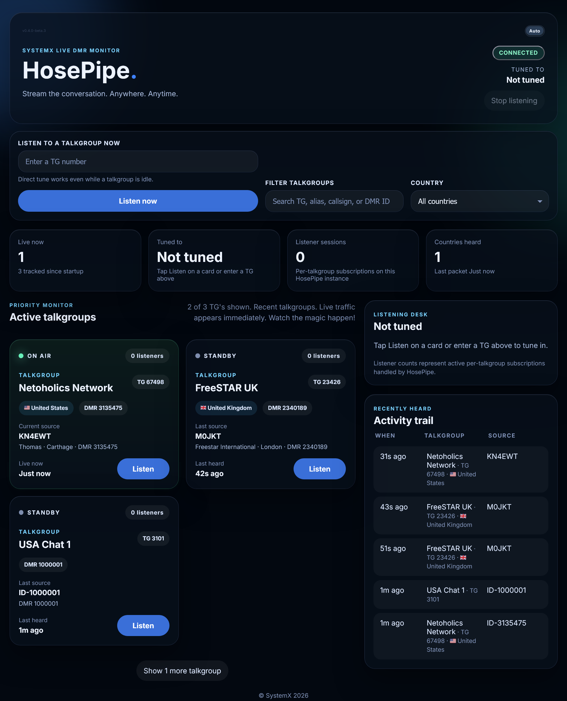

# HosePipe

**Stream the conversation. Anywhere. Anytime.**

HosePipe is a live DMR talkgroup monitor in the browser. Watch what's active, tune to a talkgroup, and listen in real time.

> **Release candidate 0.5.1-rc.1** — live at [hosepipe.freestar.network](https://hosepipe.freestar.network). Pre-stable; features may still change. See [CHANGELOG.md](CHANGELOG.md).

## Try it

**[hosepipe.freestar.network](https://hosepipe.freestar.network)**

Feedback is welcome via [Issues](https://github.com/ShaYmez/HosePipe-App/issues).

## What it does

- Live talkgroup cards — see what's active, idle, or cooling down
- **Listen** on any talkgroup, even while it's quiet
- Live audio level (VU) meters while listening — on the desk, volume dock, and cards
- Country flags on cards and a **Country** filter in the header
- Search and filter by talkgroup, alias, callsign, or country
- Recent activity trail alongside the live grid
- Volume control and optional speech clarity for clearer voice
- Light, dark, and auto theme

## Quick start

1. Open **[hosepipe.freestar.network](https://hosepipe.freestar.network)**.
2. Click **Listen** on a talkgroup card, or enter a TG number under **Listen to a talkgroup now**.
3. Adjust volume in the listening desk (or the floating volume dock on desktop; mobile shows a listening bar at the bottom).
4. Use **Filter talkgroups** or **Country** to narrow the grid.

More detail: [Getting started](docs/getting-started.md)

## Browser support

Desktop **Chrome** / **Edge** or **Firefox** recommended. Mobile works; background audio depends on your device and browser.

## Release candidate

HosePipe **0.5.1-rc.1** is a release candidate at [hosepipe.freestar.network](https://hosepipe.freestar.network). It is not the final stable release yet — please use it, share feedback, and treat the link as pre-release.

## Feedback

Found a bug or have a suggestion? [Open an issue](https://github.com/ShaYmez/HosePipe-App/issues). Include the version shown in the app footer, your browser, and the talkgroup you were listening to.

## Disclaimer

HosePipe is educational/experimental software. Use of radio codec components may be subject to separate licensing or patent restrictions depending on jurisdiction.

## License

MIT — see [LICENSE](LICENSE).
