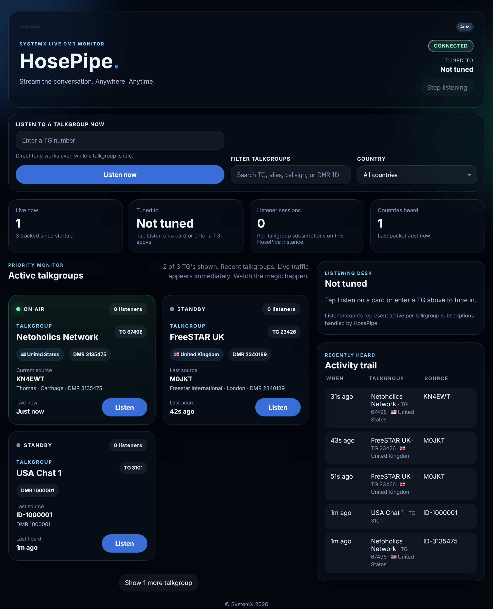

# HosePipe

**Stream the conversation. Anywhere. Anytime.**

HosePipe is FreeSTAR’s live DMR talkgroup monitor for SystemX. See what’s active, tune a talkgroup, and listen in your browser.

> **Release candidate 0.7.3-rc.2** — live at [hosepipe.freestar.network](https://hosepipe.freestar.network). Pre-stable; features may still change. See [CHANGELOG.md](CHANGELOG.md).

## Try it

**[hosepipe.freestar.network](https://hosepipe.freestar.network)**

Docs site: [shaymez.github.io/HosePipe-App](https://shaymez.github.io/HosePipe-App/) · Feedback via [Issues](https://github.com/ShaYmez/HosePipe-App/issues).

## What it does

- Live talkgroup cards — see what's active, idle, or cooling down
- **Listen** on any talkgroup, even while it's quiet
- Shareable listen links (`?tg=` / `#tg=`) that open already tuned
- Live audio level meters while listening
- Country flags on cards and a **Country** filter in the header
- Search and filter by talkgroup, alias, callsign, or country
- Browser-local **favorites** with card stars and a Favorites-only view
- Recent **Activity trail** alongside the live grid
- Optional **Net Control** for check-in order during a net (saved on your device)
- Volume / mute remembered between visits
- Optional **Speech clarity** for clearer voice (fine-tune on desktop; On/Off on mobile)
- Collapsible sidebar panels with useful previews when closed
- On desktop, rearrange sidebar panels or undock them to float on the page
- Light, dark, and auto theme

## Quick start

1. Open **[hosepipe.freestar.network](https://hosepipe.freestar.network)**.
2. Click **Listen** on a talkgroup card, or enter a TG number under **Listen to a talkgroup now**.
3. Adjust volume in the listening desk (or the floating volume dock on desktop; mobile shows a listening bar at the bottom).
4. Optionally enable **Speech clarity** — expand it on desktop to fine-tune, or use the mobile toggle.
5. Use **Filter talkgroups**, **Country**, or **Favorites** to narrow the grid.
6. For a net, open **Net Control** in the sidebar to build a check-in list.

More detail: [Getting started](docs/getting-started.md) · [Docs site](https://shaymez.github.io/HosePipe-App/getting-started.html)

## Browser support

Desktop **Chrome** / **Edge** or **Firefox** recommended. Mobile works; background audio depends on your device and browser.

## Release candidate

HosePipe **0.7.3-rc.2** is a release candidate at [hosepipe.freestar.network](https://hosepipe.freestar.network). It is not the final stable release yet — please use it, share feedback, and treat the link as pre-release. Notes: [Release candidate](docs/beta.md).

## Feedback

Found a bug or have a suggestion? [Open an issue](https://github.com/ShaYmez/HosePipe-App/issues). Include the version shown in the app footer, your browser, and the talkgroup you were listening to.

## License

MIT — see [LICENSE](LICENSE).
